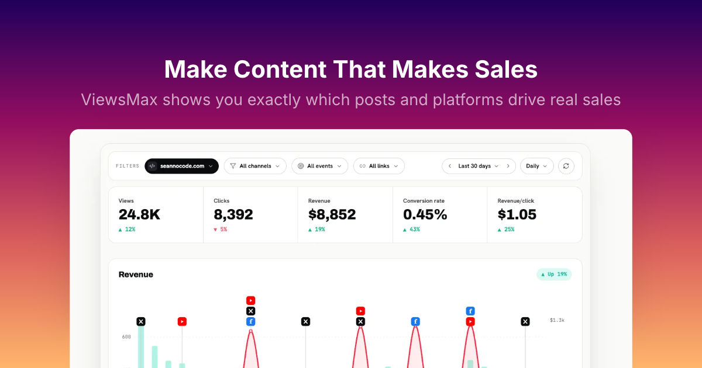

<div align="center">

<picture>
  <source media="(prefers-color-scheme: dark)" srcset="frontend/src/assets/logo-lockup-dark.svg">
  
</picture>

### Post everywhere. Track every click. See what actually sells.

Views are vanity — revenue is the score. ViewsMax lets you compose a post once,
publish it across every major platform, and trace each click and sale back to
the exact post that earned it.

<br>


<br>



</div>

## Why ViewsMax?

- **✍️ Compose once, publish everywhere** — one editor, eight platforms,
  scheduled or instant, with per-platform caption rules handled for you.
- **💰 Revenue attribution, not vanity metrics** — tracked links and offers
  tie every click, conversion, and dollar back to the post that drove it.
- **📊 One dashboard for everything** — views, clicks, conversion rate, and
  revenue-per-click across all your channels, side by side.
- **🤖 AI where it helps** — caption and thumbnail generation, plus agent
  access over MCP so your AI tools can post and pull stats for you.
- **🏠 Yours to run** — the whole stack (React + Vite frontend, Laravel 12
  API) self-hosts with a single `docker compose up`.

---

## Run it

You need [Docker Desktop](https://www.docker.com/products/docker-desktop/). Nothing else —
no PHP, Node, or Postgres on your machine.

```bash
git clone https://github.com/sean-no-code/viewsmax.git
cd viewsmax
docker compose up
```

The first run takes a few minutes: it downloads images, installs dependencies,
creates the databases and seeds them. Later runs start in seconds.

When it settles, open:

| | |
|---|---|
| **App** | http://localhost:8080 |
| **API** | http://localhost:8000 |
| **API docs** | http://localhost:8000/docs |

To stop it, press `Ctrl+C`. To start again, `docker compose up`.

That is the whole setup. Everything below is optional.

---

## Connecting real services

Out of the box the app runs fully locally — you can browse it, create an
account, and click around. Publishing to a real social platform, taking a
payment, or generating images needs credentials from those providers.

The first run created `backend/.env` for you, already pointed at the database
and with an application key generated. Open that file and fill in only the
credentials you need — every one of them is optional and blank by default.

Don't overwrite it with `.env.example`: that would wipe the generated key and
the database settings, and the app would stop starting.

After editing, apply the change:

```bash
docker compose restart app
```

### File storage

Uploads are written to local disk by default, which needs no account.

One limitation worth knowing: Instagram and TikTok publish by fetching your
media from a public HTTPS URL, so they cannot reach files on your laptop. For
real publishing, point `MEDIA_DISK` at object storage — the `r2` disk uses the
standard S3 driver, so Cloudflare R2, AWS S3, Backblaze B2, DigitalOcean
Spaces, Wasabi and MinIO all work. See the storage section of
`backend/.env.example`.

---

## Running the tests

```bash
docker compose exec app php artisan test     # backend
docker compose exec frontend npm run test:run # frontend
```

The backend suite runs against in-memory SQLite, so it needs no database setup
and never touches your development data.

---

## Common problems

**Port already in use** — something else is on 8000, 8080 or 5432. Stop it, or
change the left-hand number under `ports:` in `docker-compose.yaml`.

**Start over from scratch** — this deletes the database and all uploads:

```bash
docker compose down -v
docker compose up --build
```

**Watching what a service is doing**

```bash
docker compose logs -f app
```

---

## How it fits together

`docker compose up` starts five containers:

| Service | Role |
|---|---|
| `postgres` | Two databases — the app, plus a second one for outlier analytics |
| `app` | The Laravel API on port 8000 |
| `queue` | Background jobs: publishing, uploads, image generation |
| `scheduler` | Publishes scheduled posts when their time arrives |
| `frontend` | Vite dev server on port 8080, with hot reload |

Editing files on your machine updates the running containers — no rebuild
needed. Rebuild only after changing a `Dockerfile` or adding a dependency:

```bash
docker compose up --build
```
